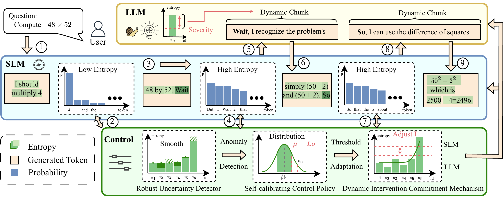

# TokenRouter

Official implementation of **TokenRouter: Uncertainty-Guided Token-Level Routing for Efficient LLM Reasoning**.

TokenRouter is a **black-box runtime controller** for collaborative reasoning between a small language model (SLM) and a large language model (LLM). Instead of making a single routing decision for the entire query, it performs **token-level routing during decoding**: the SLM handles easy spans, while the LLM is activated only when the local uncertainty signal suggests that stronger reasoning capacity is needed.

In the paper, TokenRouter retains **over 99% of pure-LLM accuracy** on GSM8K, MATH500, and AIME24, while reducing large-model usage to **56.2%–76.0%** of generated tokens.

<p align="center">
  
</p>

## Why TokenRouter?

Most routing methods decide **once per query**. That is often too coarse for chain-of-thought reasoning, where difficulty can change from one step to the next. TokenRouter instead routes **during generation**, making it possible to:

- keep cheap tokens on the SLM,
- allocate LLM capacity only to difficult spans,
- control the LLM budget explicitly,
- and avoid unstable back-and-forth switching.

## Core Ideas

TokenRouter combines three components:

1. **Robust uncertainty detector** 
   Uses token-level entropy from the SLM and smooths it into a stable local difficulty signal.

2. **Self-calibrating control policy** 
   Adapts the switching threshold online so that the actual LLM usage tracks a target budget.

3. **Dynamic intervention commitment** 
   Keeps the LLM active long enough to cover a difficult reasoning span instead of switching too frequently.

## Results

The paper reports the following main comparisons against the pure LLM setup:

| Dataset | Pure LLM Acc. | TokenRouter Acc. | LLM Token Ratio |
|---|---:|---:|---:|
| GSM8K | 94.62 | 94.09 | 59.4% |
| MATH500 | 89.00 | 88.40 | 56.2% |
| AIME24 | 46.67 | 46.67 | 76.0% |

These numbers show the intended operating point of the released implementation: near-LLM reasoning quality with substantially lower large-model usage. 

## Layout

The repository is organized as follows:

```text
assets/
  tokenrouter_overview.png
configs/
  config.json
scripts/
  run_experiments.py
  plot_results.py
tokenrouter/
  __init__.py
  benchmark.py
  cli.py
  config.py
  datasets.py
  math_parsing.py
  models.py
  plotting.py
  routing.py
  utils.py
tests/
  test_answer_extraction.py
  test_routing.py
README.md
requirements.txt
```

Key files:

- `scripts/run_experiments.py`: main experiment entry point
- `scripts/plot_results.py`: plotting entry point for saved outputs
- `configs/config.json`: public-release default hyperparameters
- `tokenrouter/benchmark.py`: experiment orchestration and result saving
- `tokenrouter/routing.py`: TokenRouter and baseline routing policies
- `tokenrouter/models.py`: vLLM-backed inference wrapper


## Installation

### Requirements

- Python **3.10+**
- A working **CUDA + PyTorch + vLLM** environment
- GPU memory sufficient for the selected LLM/SLM pair
- Access to the Hugging Face model and dataset IDs you plan to use

### Install dependencies

```bash
pip install -r requirements.txt
```

## Experimental Setup

### Models

Unless you override them, the code uses:

- **LLM**: `deepseek-ai/DeepSeek-R1-Distill-Qwen-14B`
- **SLM**: `deepseek-ai/DeepSeek-R1-Distill-Qwen-1.5B`

### Datasets

The default public datasets are:

- `openai/gsm8k` with the `main` configuration and `validation` split
- `HuggingFaceH4/MATH-500` with the `test` split
- `HuggingFaceH4/aime_2024` with the `train` split

### Default target LLM budgets

The CLI uses the following default target ratios:

- **GSM8K**: `0.7`
- **MATH**: `0.8`
- **AIME**: `0.8`

## Quick Start

Runs TokenRouter with one or more target LLM budgets:

```bash
python scripts/run_experiments.py --dataset GSM8K --mode main --target_ratios 0.7
python scripts/run_experiments.py --dataset MATH  --mode main --target_ratios 0.8
python scripts/run_experiments.py --dataset AIME  --mode main --target_ratios 0.8
```

## Command-Line Arguments

Core options exposed by `run_experiments.py`:

- `--dataset {GSM8K,MATH,AIME,all}`
- `--mode {main,baselines,ablation,all}`
- `--num_samples N`
- `--llm_path PATH_OR_ID`
- `--slm_path PATH_OR_ID`
- `--llm_gpus ID [ID ...]`
- `--slm_gpu ID`
- `--target_ratios R [R ...]`
- `--output_dir DIR`

## Outputs

Each run creates a timestamped directory under `results/` unless `--output_dir` is provided.

A typical output directory contains:

- `results.json`: per-example predictions and raw metrics
- `results_analysis.json`: aggregated metrics by dataset and method
- `results_summary.csv`: compact summary table

## Plotting

After running experiments, generate the provided analysis plots with:

```bash
python scripts/plot_results.py --results_dir results/<timestamp>
```

By default, plots are written to `results/<timestamp>/plots/`.
